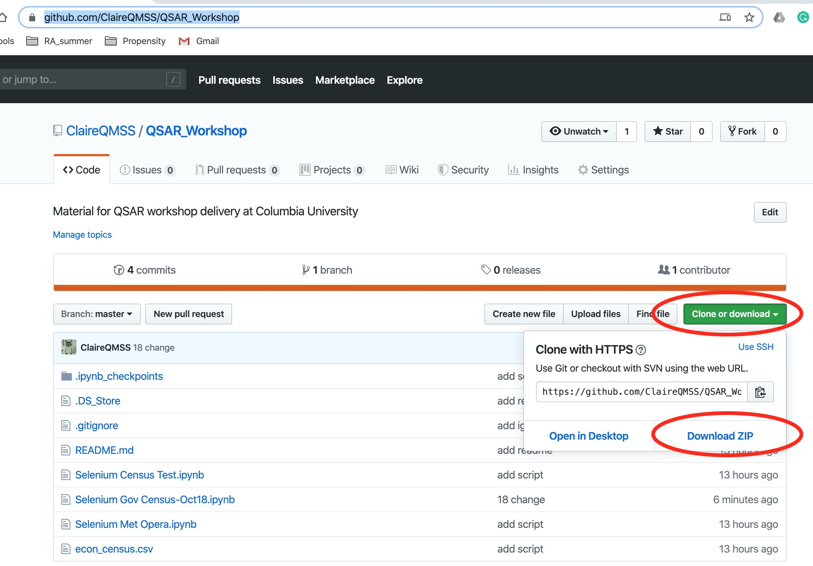

# QSAR Webscrap workshop

## Install Requirements

[Video Tutorial](https://youtu.be/G4MLhb-HGN8)

- [ ] ##### Python Anaconda distribution 3.7

  https://www.anaconda.com/distribution/

- [ ] ##### Jupyter notebook (Python Library)

  ``` bash
  pip install jupyter notebook
  ```

  

- [ ] ##### Chrome Driver

  https://sites.google.com/a/chromium.org/chromedriver/downloads

  unzip chrome driver

  Press command and N to have a new Finder window

  Go -> Go to Folder: /usr/local/bin

  Drag chrome driver to /usr/local/bin

- [ ] ##### selenium (Python Library)

  ```bash
  pip install selenium
  ```


## Workshop Main Script

Go to https://github.com/ClaireQMSS/QSAR_Workshop

Download zip file

Please download to follow the workshop!